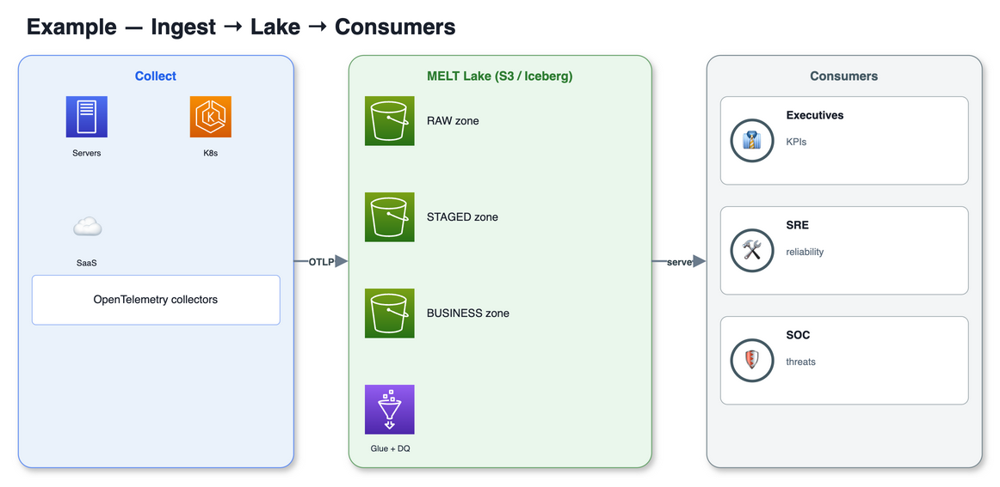
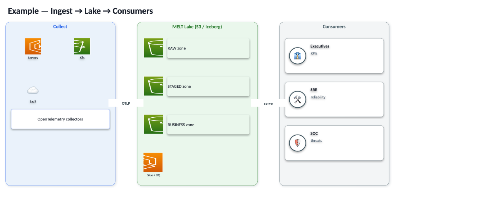

# png-to-drawio — a Claude skill

**Turn a PNG/image of an architecture diagram into an *editable* [draw.io](https://www.drawio.com/) file — and optionally a native PowerPoint where every box, icon, and label is a real object (not a flat picture).**

This is a [Claude Code](https://docs.claude.com/en/docs/claude-code) **skill**. Drop it into `~/.claude/skills/` and Claude will use it whenever you ask to "turn this PNG into draw.io", "make this diagram editable", or "export the diagram to PowerPoint with real shapes".

---

## Why this exists

AI image generators (GPT‑image, Codex, Nano‑Banana, etc.) produce great‑looking architecture diagrams, but they have three fatal flaws as an engineering artifact:

| Problem | Consequence |
|---|---|
| **Non‑deterministic** | Every run renders differently — you can't reproduce or iterate. |
| **Not editable** | The output is a flat raster (PNG). Any change means re‑generating → a *different* picture. |
| **Garbled labels/icons** | Image models routinely mangle text and icons — risky for a technical diagram. |

So AI image‑gen is fine for **concept/mood**, but not for a source‑of‑truth diagram. This skill does the **reverse transform**: it recreates the raster as native, editable vector shapes, so you get a diagram you can version, edit, and re‑export forever.

> **There is no reliable automated raster→shapes converter.** draw.io can only import an image as a *picture*. The robust path is **recreation** — and that's exactly what this skill streamlines, capturing all the hard‑won details (especially which AWS icon names actually render) so it isn't a slow, manual slog every time.

---

## Demo

One `layout(d)` function → **both** of these, from the same code:

**draw.io (vector, fully editable in diagrams.net):**



**Native PowerPoint (every element an editable PPT object):**



Sources: [`examples/example.drawio`](examples/example.drawio) · [`examples/example.pptx`](examples/example.pptx) · generated by [`assets/example.py`](assets/example.py).

---

## Features

- 🎯 **One layout, two outputs.** Write the diagram once with a tiny helper API; render to **draw.io** *and* **native PPTX** (identical interfaces — no duplicated layout code).
- ✅ **Verified AWS icon map.** A curated set of `mxgraph.aws4` icon names **confirmed to render** — plus the long list of plausible‑but‑blank names to avoid (S3 is `s3`, *not* `simple_storage_service`, etc.). See [`references/aws4-icon-map.md`](references/aws4-icon-map.md).
- 🔁 **Render → compare → iterate loop.** A draw.io CLI wrapper exports PNG/SVG so Claude can view the result and tighten alignment.
- 🧩 **Icon‑name verifier.** Render any candidate icon names and *see* which resolve before trusting them.
- 🖼️ **Reference‑layer overlay.** Embeds the original PNG as a locked, faded layer so you can diff the recreation against the source.
- 🧹 **Declutter built‑in.** Softened borders, subtle shadows, and emoji for non‑AWS concepts keep dense diagrams calm.
- 🔒 **No lock‑in.** Output is plain `.drawio` (mxGraph XML) and `.pptx` (OOXML).

---

## Repository layout

```
.
├── package.json                # enables `npx github:quincysting/claudeskill_png_drawio`
├── bin/
│   └── install.js              # zero-dependency installer → ~/.claude/skills/png-to-drawio
├── SKILL.md                    # the skill manifest Claude reads (workflow + gotchas)
├── assets/
│   ├── aws_icons.py            # verified AWS4 icon map + category colours + soft()
│   ├── drawio_builder.py       # DrawioBuilder — write layout(d) → .drawio
│   ├── pptx_builder.py         # PptxBuilder — same interface → native .pptx
│   ├── crop_icons.py           # crop AWS icons from draw.io stencils (for pptx)
│   ├── verify_icons.py         # render candidate icon names to see which resolve
│   ├── render.sh               # draw.io CLI export wrapper (png + svg)
│   ├── tiles.py                # crop a source image into zoomed study tiles
│   └── example.py              # one layout(d) → BOTH backends (canonical usage)
├── references/
│   └── aws4-icon-map.md        # verified vs blank icon names + how to extend
├── docs/
│   ├── INSTALL.md              # installation + prerequisites
│   ├── USAGE.md                # builder API reference + recipes
│   └── METHOD.md               # the recreation methodology (the "why")
└── examples/                   # generated demo outputs
```

---

## Prerequisites

- **[draw.io desktop](https://github.com/jgraph/drawio-desktop/releases)** (provides the CLI used for rendering and icon cropping):
  - macOS: `brew install --cask drawio` → CLI at `/Applications/draw.io.app/Contents/MacOS/draw.io`
- **Python 3** with **Pillow** (`pip install pillow`)
- For the **PPTX** path: **python‑pptx** (`pip install python-pptx`)

See [docs/INSTALL.md](docs/INSTALL.md) for details (including overriding the draw.io path via `$DRAWIO`).

---

## Install (as a Claude Code skill)

### Quickest — `npx` (no clone, no manual copy)

```bash
npx github:quincysting/claudeskill_png_drawio
```

This runs a zero‑dependency installer that copies the skill into
`~/.claude/skills/png-to-drawio`. Options:

- **Custom location:** `npx github:quincysting/claudeskill_png_drawio /path/to/skills` (or set `CLAUDE_SKILLS_DIR`).
- **Overwrite in place:** add `--force` (otherwise an existing install is moved to a timestamped `.bak-…`).

### Manual (clone & copy)

```bash
git clone https://github.com/quincysting/claudeskill_png_drawio.git
mkdir -p ~/.claude/skills
cp -R claudeskill_png_drawio ~/.claude/skills/png-to-drawio
```

Either way: **restart Claude Code** (or start a new session), then just ask, e.g.:

> "Turn `ref/architecture.png` into an editable draw.io, then export a PowerPoint with real shapes."

Claude reads `SKILL.md` and follows the workflow. (The skill is the functional
core — `SKILL.md` + `assets/` + `references/`; the `npx` installer copies exactly
those.)

---

## Quick start (standalone)

You can also run the builders directly without Claude:

```bash
cd ~/.claude/skills/png-to-drawio/assets   # or the cloned repo's assets/
python3 example.py
#   -> /tmp/example.drawio   (open in draw.io)
#   -> /tmp/example.pptx     (open in PowerPoint)
```

Minimal custom diagram:

```python
from drawio_builder import DrawioBuilder
d = DrawioBuilder(w=900, h=380, bg_png="original.png", shadow_ids={"g_lake"})
d.grp("g_lake", "MELT Lake (S3 / Iceberg)", 250, 40, 220, 300, "#2E7D32", "#EAF7EC")
d.aws("z_raw", "", 262, 70, "s3", 36)
d.box("z_raw_t", "RAW zone", 305, 70, 150, 36, fill="#EAF7EC", stroke="none", align="left")
d.edge("g_collect", "g_lake", "OTLP")
d.save("out.drawio")
```

Render it (so you can view and iterate):

```bash
bash render.sh out.drawio 1.6     # -> out.png + out.svg
```

Full API and recipes: [docs/USAGE.md](docs/USAGE.md).

---

## How it works (the method)

1. **Study** the source image (zoomed tiles) and enumerate every cluster/node/label.
2. **Recreate from the spec, not the pixels** — AI image text is often wrong; use the real architecture as ground truth and the image only for layout.
3. **Build** on a clean grid (fixed columns, aligned tops) using the helper API.
4. **Use only verified icon names** — verify any new one with `verify_icons.py`.
5. **Render → compare → iterate** with `render.sh` until it matches.
6. **(Optional) export native PPTX** — crop icons once, run the *same* layout through `PptxBuilder`.

The full rationale and pitfalls are in [docs/METHOD.md](docs/METHOD.md).

---

## Gotchas worth knowing

- **Escape `& < >` in labels** — otherwise draw.io silently stops parsing at the bad character and renders only the part before it. (The builders do this for you.)
- **Icon‑name roulette** — many obvious AWS names render blank. Always check [`references/aws4-icon-map.md`](references/aws4-icon-map.md) or run `verify_icons.py`.
- **macOS has no `timeout`** — don't wrap the draw.io CLI in it; poll for the output file. The Electron `task_policy_set` warning is harmless.
- **Emoji render in colour** on macOS/PowerPoint — use them for non‑AWS concepts (SaaS, personas, value icons).

---

## Limitations

- It's a **recreation tool**, not a magic OCR converter — for very dense diagrams the layout is still authored (this skill just makes that fast and repeatable).
- Rendering/cropping require the **draw.io desktop CLI** (Electron). Headless Linux works with `xvfb`.
- The verified icon map targets **draw.io desktop 30.x**; names are stable but new services may need a quick `verify_icons.py` check.

---

## Contributing

PRs welcome — especially additions to the verified icon map (include a screenshot from `verify_icons.py`) and new builder helpers. Keep the `DrawioBuilder` and `PptxBuilder` interfaces identical so the "one layout, two backends" guarantee holds.

---

## License

[MIT](LICENSE).

---

## Acknowledgements

Born from a real engagement where an AI‑generated architecture PNG needed to become an editable, version‑controlled diagram. The lessons (no auto‑converter; recreate from spec; the AWS icon‑name traps; one‑layout‑two‑backends) are distilled here so the next person doesn't have to relearn them. Built with [Claude Code](https://claude.com/claude-code).
